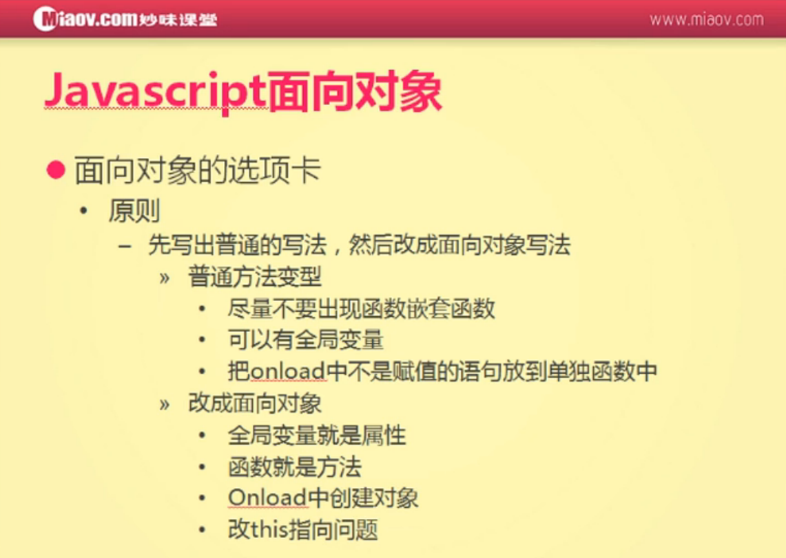

#传统的过程式编写选项卡



```
window.onload = function(){
    var oParent = document.getElementById('div1');
    var aInput = oParent.getElementsByTagName('input');
    var aDiv = oParent.getElementsByTagName('div');

    for(var i=0; i<aInput.length; i++){
        aInput[i].index = i;
        aInput[i].onclick = function(){
            for(var j=0; j<aInput.length; j++){
                aInput[j].className = '';
                aDiv[j].style.display = 'none';
            }
            this.className = 'active';
            aDiv[this.index].style.display = 'block';
        };
    }
};
```

先变型：
尽量不要出现函数嵌套函数
可以有全局变量