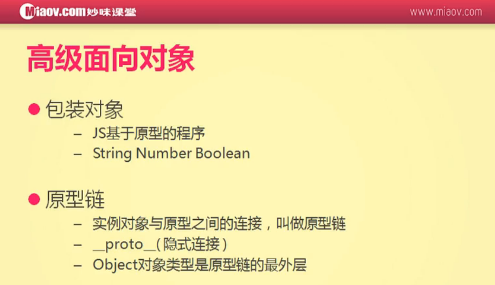

#JS面向对象及组件开发



###JS是基于原型的程序

自定义arr的push方法
```
<script>
var arr = [1,2,3];

Array.prototype.push = function(){
    for(var i=0; i<arguments.length; i++){
        this[this.length] = arguments[i];
    }
    return this.length;
};

arr.push(4,5,6);

alert(arr);
</script>
```

###什么是包装对象
```
var str = 'hello';
alert(typeof str);               // string
alert(str.charAt(0));            // h
alert(str.length);               // 5
```


