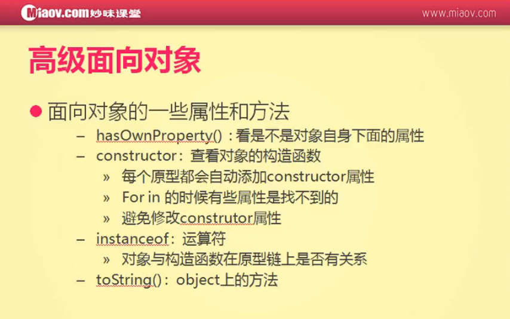

#hasOwnProperty和constructor的使用



hasOwnProperty 看是不是对象自身下面的属性
```
var arr = [];
arr.num = 10;
Array.prototype.num2 = 20;

alert( arr.hasOwnProperty('num') );     // true
alert( arr.hasOwnProperty('num2') );    // false
```

constructor：查看对象的构造函数
```
function Aaa(){

}
var a1 = new Aaa();
alert( a1.constructor );


var arr = [];
alert( arr.constructor );

alert( arr.constructor == Array );      // true
```

```
function Aaa(){

}
// Aaa.prototype.constructor = Aaa;        // 这句话是系统自动生成的，也是由系统生成的唯一的一句话
var a1 = new Aaa();
alert(a1.constructor);
```

```
function Aaa(){

}
// Aaa.prototype.constructor = Aaa;        // 每一个函数都会有的，都是系统自动生成的
Aaa.prototype.constructor = Array;         // 可以把它覆盖掉
var a1 = new Aaa();
alert(a1.constructor);
```

系统只会自动生成一个constructor，那hasOwnProperty又是从哪里来的呢
```
function Aaa(){

}
var a1 = new Aaa();
alert(a1.hasOwnProperty == Object.prototype.hasOwnProperty);    // true
```
这说明a1.hasOwnProperty中的hasOwnProperty方法是在Object对象下面的

有时候我们会在不经意间就把constructor改掉了
```
function Aaa(){

}
Aaa.prototype.name = 'zhangsan';
Aaa.prototype.age = 20;
var a1 = new Aaa();
alert( a1.constructor );
```
转换成简写形式
```
function Aaa(){

}
Aaa.prototype = {
    name: 'zhangsan',
    age: 20
};
var a1 = new Aaa();
alert( a1.constructor );
```
上面这种写法就会把constructor改掉。如果想要使用简写形式，需要修正constructor的指向
```
function Aaa(){

}
Aaa.prototype = {
    constructor: Aaa,
    name: 'zhangsan',
    age: 20
};
var a1 = new Aaa();
alert( a1.constructor );
```

系统自动生成的属性 for in 是找不到的
```
function Aaa(){

}

for(var attr in Aaa.prototype){
    alert(attr);
}
```
重写系统自动生成的属性 for in 同样找不到
```
function Aaa(){

}

Aaa.prototype.constructor = Aaa;

for(var attr in Aaa.prototype){
    alert(attr);
}
```
非系统自动生成的属性 for in 可以找到
```
function Aaa(){

}

Aaa.prototype.name = 'zhangsan';

for(var attr in Aaa.prototype){
    alert(attr);    // zhangsan
}
```