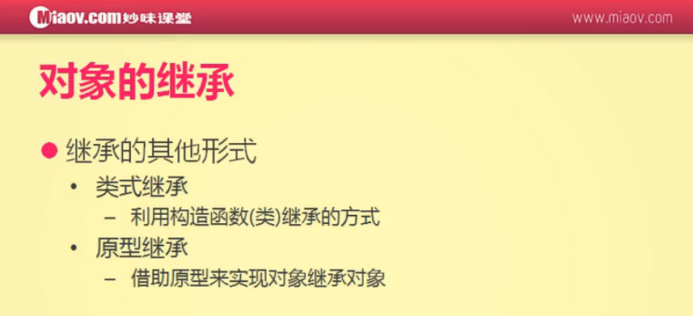
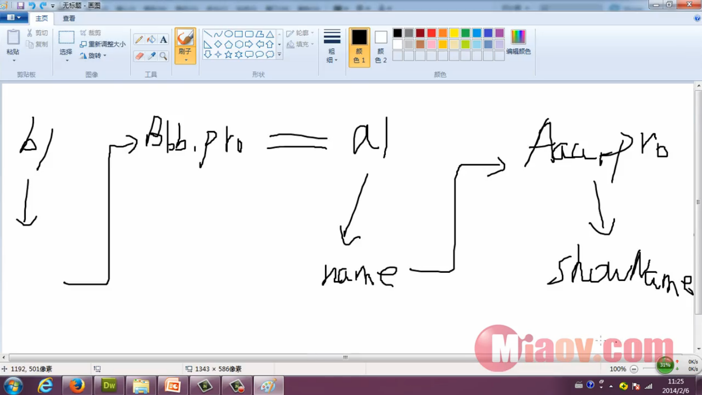
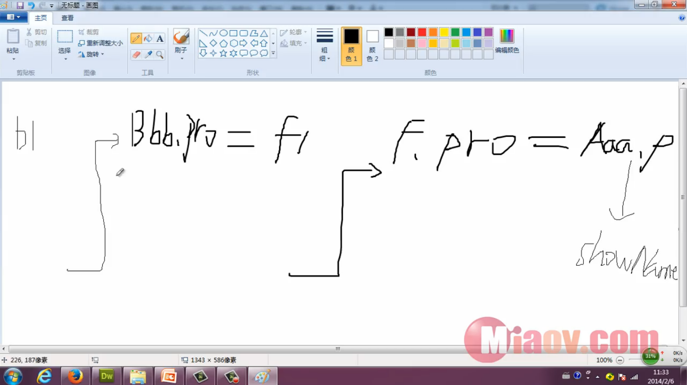

#继承的其他形式之类式继承



类：JS是没有类的概念的，在JS中可以把构造函数看做是类
```
function Aaa(){             // 父类
    this.name = '小明';
}

Aaa.prototype.showName = function(){
    alert(this.name);
};

function Bbb(){             // 子类

}

Bbb.prototype = new Aaa();  // 这一句话就是类式继承
var b1 = new Bbb();
b1.showName();              // 小明
alert(b1.name);             // 小明
```

b1调用showName方法的过程：它会先从b1开始找，由于b1本身并没有showName方法，因此它会通过原型链找到Bbb.prototype继而找到a1，a1下面也没有showName方法，于是a1又会通过原型链找到Aaa.prototype就能找到showName方法了。同理：alert(b1.name)也能弹出小明。不过这种写法还有很多问题



问题一：constructor指向问题
```
function Aaa(){                         // 父类
    this.name = '小明';
}

Aaa.prototype.showName = function(){
    alert(this.name);
};

function Bbb(){                         // 子类

}

Bbb.prototype = new Aaa();              // 这一句话就是类式继承
var b1 = new Bbb();

alert(b1.constructor);
```
打印出来的结果是
```
function Aaa(){             // 父类
    this.name = '小明';
}
```
这就说明Bbb的constructor指向被修改了，解决如下：
```
function Aaa(){                         // 父类
    this.name = '小明';
}

Aaa.prototype.showName = function(){
    alert(this.name);
};

function Bbb(){                         // 子类

}

Bbb.prototype = new Aaa();              // 这一句话就是类式继承
Bbb.prototype.constructor = Bbb;        // 修正 constructor 指向

var b1 = new Bbb();

alert(b1.constructor);
```

问题二：多个对象之间属性会相互影响
```
function Aaa() {                         // 父类
    this.name = [1, 2, 3];
}

Aaa.prototype.showName = function () {
    alert(this.name);
};

function Bbb() {                         // 子类

}

Bbb.prototype = new Aaa();              // 这一句话就是类式继承
Bbb.prototype.constructor = Bbb;        // 修正 constructor 指向

var b1 = new Bbb();
b1.name.push(4);

var b2 = new Bbb();

alert(b2.name);                         // 1,2,3,4
```

解决方法：属性和方法继承的时候要分开继承



```
function Aaa() {                         // 父类
    this.name = [1, 2, 3];
}

Aaa.prototype.showName = function () {
    alert(this.name);
};

function Bbb() {                         // 子类

}

// 继承方法
var F = function(){};
F.prototype = Aaa.prototype;
Bbb.prototype = new F();                // 这一句话就是类式继承
Bbb.prototype.constructor = Bbb;        // 修正 constructor 指向

var b1 = new Bbb();
var b2 = new Bbb();

alert(b2.name);                         // undefined
```
通过上面可以看出通过b2去找name属性是找不到的，因为只继承了方法，最终解决方法如下：

```
function Aaa() {                         // 父类
    this.name = [1, 2, 3];
}

Aaa.prototype.showName = function () {
    alert(this.name);
};

function Bbb() {                         // 子类
    // 继承属性
    Aaa.call(this);
}

// 继承方法
var F = function(){};
F.prototype = Aaa.prototype;
Bbb.prototype = new F();                // 这一句话就是类式继承
Bbb.prototype.constructor = Bbb;        // 修正 constructor 指向

var b1 = new Bbb();
b1.name.push(4);

var b2 = new Bbb();

alert(b2.name);                         // 1,2,3
```


