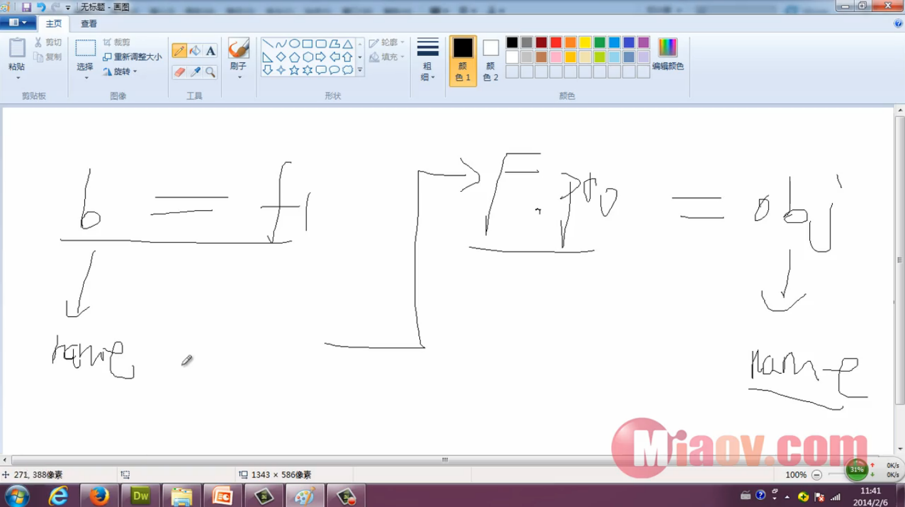

#继承的其他形式之原型继承

```
var a = {
    name: '小明'
};

var b = cloneObj(a);

alert(b.name);              // 小明

function cloneObj(obj){
    var F = function(){};
    F.prototype = obj;
    return new F();
}
```


```
var a = {
    name: '小明'
};

var b = cloneObj(a);

alert(b.name);              // 小明

b.name = '小张';

alert(b.name);              // 小张
alert(a.name);              // 小明

function cloneObj(obj){
    var F = function(){};
    F.prototype = obj;
    return new F();
}
```



总结：
拷贝继承：通用型的 适用于有new或无new的时候都可以
类式继承：适用于new构造函数
原型继承：适用于无new的对象