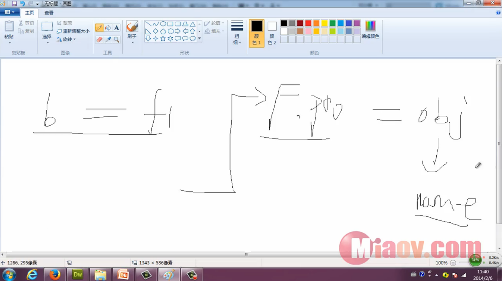

#继承的其他形式之原型继承

```
var a = {
    name: '小明'
};

var b = cloneObj(a);

alert(b.name);              // 小明

function cloneObj(obj){
    var F = function(){};
    F.prototype = obj;
    return new F();
}
```

