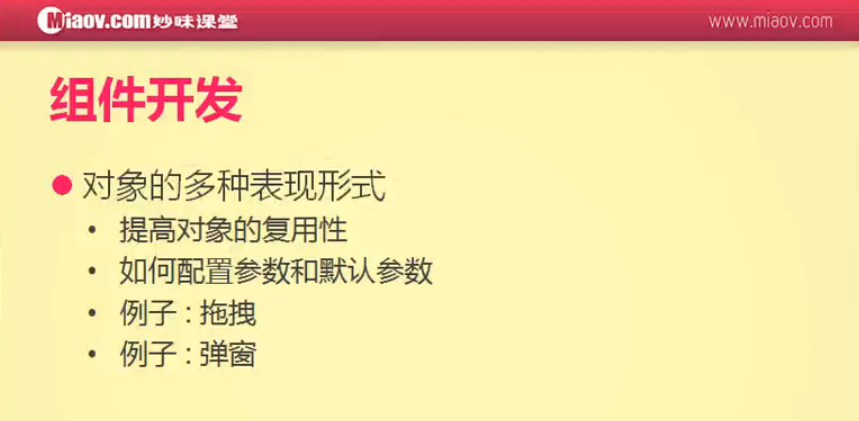

#组件开发是什么



组件开发：多组对象，像兄弟之间的关系（代码复用的一种形式）
组件开发的第一个问题，当参数不写的情况下会报错；第二个问题当参数特别多的情况下，就会出现参数顺序的问题
```
<style>
    #div1, #div2, #div3, #div4{
        width: 100px;
        height: 100px;
        position: absolute;
    }
    #div1{
        background: #c40000;
    }
    #div2{
        background: green;
        left: 100px;
    }
    #div3{
        background: brown;
        left: 200px;
    }
    #div4{
        background: blue;
        left: 300px;
    }
</style>

<script>
    window.onload = function () {
        var d1 = new Drag();
        d1.init('div1');

        var d2 = new Drag();
        d2.init('div2', function () {
            document.title = 'hello';
        });

        var d3 = new Drag();
        d3.init('div3', function () {
            document.title = '妙味';
        }, function () {
            document.title = '课堂';
        });

        var d4 = new Drag();
        d4.init('div4', function () {
            document.title = 'byebye';
        });
    };

    function Drag() {
        this.obj = null;
        this.disX = 0;
        this.disY = 0;
    }

    Drag.prototype.init = function (id, toDown, toUp) {
        var _this = this;

        this.obj = document.getElementById(id);

        this.obj.onmousedown = function (e) {
            var e = e || window.event;
            _this.fnDown(e);

            toDown();

            document.onmousemove = function (e) {
                var e = e || window.event;
                _this.fnMove(e);
            };

            document.onmouseup = function () {
                _this.fnUp();
                toUp();
            };

            return false;
        };
    };

    Drag.prototype.fnDown = function (e) {
        this.disX = e.clientX - this.obj.offsetLeft;
        this.disY = e.clientY - this.obj.offsetTop;
    };

    Drag.prototype.fnMove = function (e) {
        this.obj.style.left = e.clientX - this.disX + 'px';
        this.obj.style.top = e.clientY - this.disY + 'px';
    };

    Drag.prototype.fnUp = function () {
        document.onmousemove = null;
        document.onmouseup = null;
    };

    function extend(obj1, obj2) {
        for (var attr in obj2) {
            obj1[attr] = obj2[attr];
        }
    }
</script>

<div id="div1"></div>
<div id="div2"></div>
<div id="div3"></div>
<div id="div4"></div>
```

解决方法：参考下一节